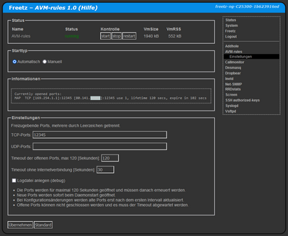

# AVM-rules
 - Package: [master/make/pkgs/avm-rules/](https://github.com/Freetz-NG/freetz-ng/tree/master/make/pkgs/avm-rules/)
 - Maintainer: -

Mit AVM-rules können (ausschliesslich) Ports der Fritz!Box selbst für Zugriff aus dem Internet freigegeben werden.<br>
<br>
<a href='../screenshots/000-PKG_avm-rules.png'></a>
<br>

Dazu wird ```pcplisten``` verwendet, nur für IPv4-Freigaben. Zu finden im menuconfig unter ```packages > webif```.

 * Die Ports werden für maximal 120 Sekunden geöffnet und müssen danach erneuert werden.
 * Neue Ports werden sofort beim Daemonstart geöffnet.
 * Bei Konfigurationsänderungen werden alte Ports erst nach dem ersten Intervall aktualisiert.
 * Offene Ports können nicht geschlossen werden und es muss der Timeout abgewartet werden.

